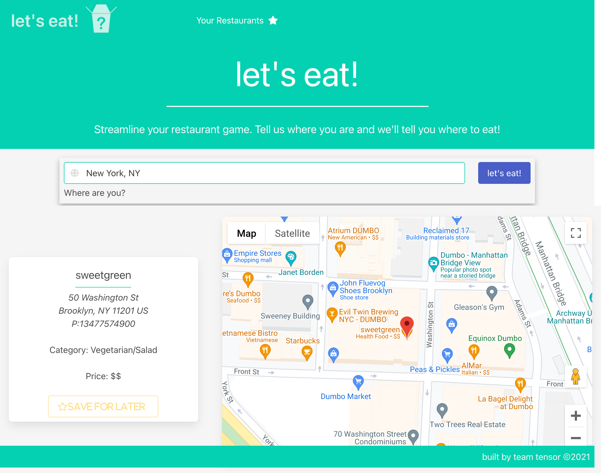
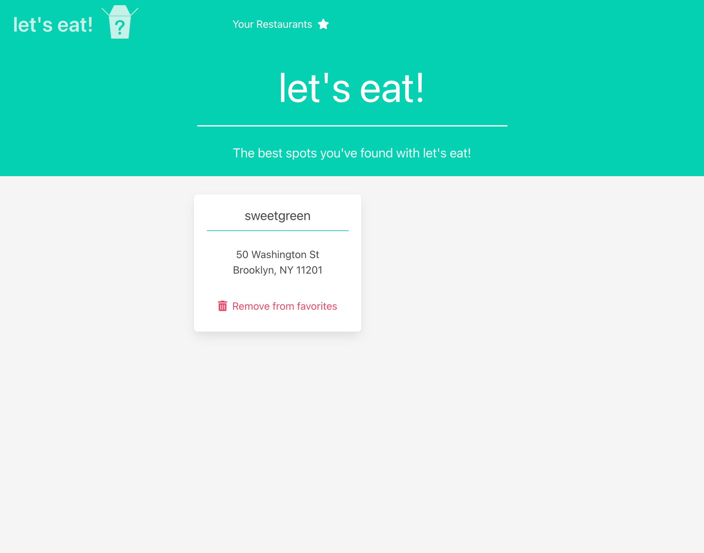

# Let's Eat

## Description

A web app where the user inputs a location and a restaurant is randomly selected and rendered on Google Maps. The app uses the Yelp Fusion API to find a restaurant based on inputed location, whether a zipcode or an address. The goal here is to streamline the decision of where to eat by generating only one restaurant at random. This app was created in response to the overwhelming choices people face each day. Check out the live app [here](https://a-breezy.github.io/LetsEat/).

Also, in order to bypass CORS issues, an Express server was created for the sole purpose of using the CORS middleware to fix the error.

## Table of Contents

- [Let's Eat](#lets-eat)
  - [Description](#description)
  - [Table of Contents](#table-of-contents)
  - [Links](#links)
  - [Usages](#usages)
  - [Resources](#resources)
  - [Contribution](#contribution)

## Links

- [Live page](https://a-breezy.github.io/LetsEat/)
- [GitHub Repo](https://github.com/a-breezy/LetsEat)

## Usages

## Resources

- [Yelp Fusion API](https://fusion.yelp.com/)
- [Google Maps](https://developers.google.com/maps/apis-by-platform)
- [Bulma](https://bulma.io/)
- [fontAwesome](https://fontawesome.com/)
- [Google Fonts](https://fonts.google.com/)
- [jQuery](https://jquery.com/)
- [Polyfill.io](https://polyfill.io/v3/)
- [Moment](https://momentjs.com/docs/)
- [Axios](https://axios-http.com/)
- [CORS](https://www.npmjs.com/package/cors)

## Contribution

Made with ❤️ by team tensor &copy;2021

- [@labchild](https://github.com/labchild)
- [@pcancio](https://github.com/pcancio)
- [@andrewyu22](https://github.com/andrewyu22)
- [@a-breezy](https://github.com/a-breezy)
